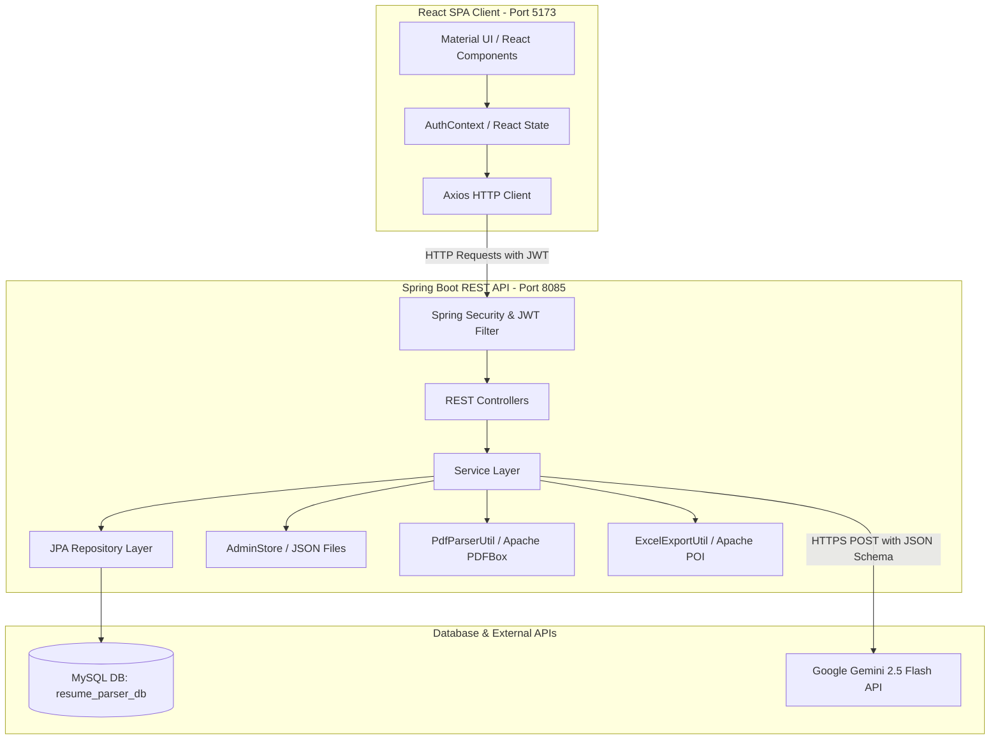

# AI Resume Parser - Project Explanation

This document provides a comprehensive overview of the **AI Resume Parser** project. It covers the system architecture, technology stack, folder structure, database design, API flows, authentication mechanisms, the AI-powered resume parsing pipeline, key classes, and deployment requirements.

---

## 1. System Architecture

The application is built on a modern **Client-Server Architecture** consisting of a React-based Single Page Application (SPA) frontend and a Spring Boot-based REST API backend.



### High-Level Component Roles:
*   **Frontend**: Captures user actions (PDF uploads, candidate searches, profile reviews, and admin dashboard controls), manages authentication state in local storage, and renders data using Material UI (MUI) and Recharts.
*   **Backend REST API**: Exposes endpoints for authentication, resume parsing, candidate data management, and administrator actions. It enforces role-based security (`ADMIN` vs. `HR`).
*   **Database (MySQL)**: Stores persistent application data (users and candidates).
*   **Local Admin Store**: A file-system-based secondary database (`admin_data/`) storing transient admin data (recycle bin, activity logs, deactivated users).
*   **AI Integration**: Utilizes Google's Gemini 2.5 Flash API to perform structured data extraction and candidate-job matching.

---

## 2. Technology Stack

### Backend (Java Spring Boot)
*   **Framework**: Spring Boot `3.3.0`
*   **Language**: Java `21`
*   **Security**: Spring Security (Stateless, JWT-based)
*   **Database Access**: Spring Data JPA (Hibernate ORM)
*   **Database Connector**: MySQL Connector/J
*   **PDF Parsing**: Apache PDFBox `2.0.29` (for extracting raw text from PDFs)
*   **Excel Generation**: Apache POI `5.2.3` (for exporting candidate databases to Excel sheets)
*   **JWT Utility**: io.jsonwebtoken `0.11.5`
*   **JSON Serialization**: Jackson (integrated into Spring Boot)
*   **Boilerplate Reduction**: Project Lombok

### Frontend (React)
*   **Build Tool**: Vite `5.2.0`
*   **Library**: React `18.2.0`
*   **Routing**: React Router Dom `6.22.3`
*   **Styling & UI**: Material UI (MUI) `5.15.15` & Emotion
*   **API Client**: Axios `1.6.8`
*   **Data Visualization**: Recharts `2.12.3` (for dashboard analytics)

### AI & LLM
*   **Model**: Google Gemini 2.5 Flash (`gemini-2.5-flash`) via the `generativelanguage.googleapis.com` API.
*   **Feature**: JSON Schema enforcement (`responseSchema`) to guarantee structured JSON output directly from the LLM.

---

## 3. Folder Structure

```text
project2/
├── backend/                             # Spring Boot Backend
│   ├── admin_data/                      # Local JSON store for administrative data
│   │   ├── activity_logs.json           # Audit logs of system actions
│   │   ├── deactivated_users.json       # Set of deactivated HR usernames
│   │   └── recycle_bin.json             # Temporarily deleted candidate records
│   ├── src/
│   │   ├── main/
│   │   │   ├── java/com/resumeparser/
│   │   │   │   ├── ResumeParserApplication.java  # Main entry point
│   │   │   │   ├── config/              # Configuration files (Security, DB Init)
│   │   │   │   ├── controller/          # REST Endpoints (Auth, Resume, Candidates, Admin)
│   │   │   │   ├── dto/                 # Request/Response Data Transfer Objects
│   │   │   │   ├── entity/              # JPA Entities mapped to MySQL tables
│   │   │   │   ├── exception/           # Custom exceptions & global exception handler
│   │   │   │   ├── repository/          # Spring Data JPA Repository interfaces
│   │   │   │   ├── security/            # Security filters, JWT providers, user details
│   │   │   │   ├── service/             # Core business services (Gemini, Auth, Candidate)
│   │   │   │   └── util/                # Parsers, Excel exporters, PDF text extractors
│   │   │   └── resources/
│   │   │       └── application.properties # Server, database, and Gemini configurations
│   │   └── test/                        # JUnit test suites
│   └── pom.xml                          # Maven dependencies and build configuration
│
└── frontend/                            # React Frontend
    ├── dist/                            # Production build output
    ├── src/
    │   ├── components/                  # Reusable UI components (Sidebar)
    │   ├── context/                     # Context providers (AuthContext)
    │   ├── pages/                       # Page-level components
    │   │   ├── AdminDashboard.jsx       # Admin metrics & system analytics
    │   │   ├── AiMatchCenter.jsx        # Job description candidate matching UI
    │   │   ├── Analytics.jsx            # HR analytics & charts
    │   │   ├── CandidatesDatabase.jsx   # Searchable candidate registry table
    │   │   ├── Dashboard.jsx            # HR quick dashboard
    │   │   ├── HRManagement.jsx         # Admin view to manage HR accounts
    │   │   ├── Login.jsx / Register.jsx # Authentication pages
    │   │   ├── Profile.jsx / Settings.jsx # User profile & preferences
    │   │   ├── ReviewPage.jsx           # Detailed view of parsed candidate data
    │   │   └── UploadResume.jsx         # PDF drag-and-drop uploader
    │   ├── App.jsx                      # Client router and Material UI theme configuration
    │   ├── main.jsx                     # Vite entry point
    │   └── index.css                    # Global CSS styles
    ├── package.json                     # Frontend dependencies & scripts
    └── vite.config.js                   # Vite configuration (includes API proxies)
```

---

## 4. Database Schema

The application utilizes a hybrid database approach:
1.  **MySQL Database (`resume_parser_db`)**: Stores the primary application entities.
2.  **File-System JSON Database (`admin_data/`)**: Stores administrative audit logs, deactivated accounts, and the recycle bin to minimize MySQL transactional load for secondary operations.

### MySQL Tables

#### 1. `users`
Stores user accounts for system access.
*   `id` (BIGINT, Primary Key, Auto-Increment)
*   `username` (VARCHAR, Unique, Not Null)
*   `password` (VARCHAR, Not Null) - BCrypt encrypted
*   `email` (VARCHAR, Unique, Not Null)
*   `role` (VARCHAR, Not Null) - Enum values: `ADMIN`, `HR`

#### 2. `candidates`
Stores parsed and structured candidate profiles.
*   `id` (BIGINT, Primary Key, Auto-Increment)
*   `name` (VARCHAR, Nullable)
*   `email` (VARCHAR, Nullable)
*   `phone` (VARCHAR, Nullable)
*   `linkedin` (VARCHAR, Nullable)
*   `github` (VARCHAR, Nullable)
*   `skills` (TEXT, Nullable) - Stored as a JSON String Array (e.g., `["Java", "React"]`)
*   `experience` (TEXT, Nullable) - Detailed job history text or `"Fresher"`
*   `education` (TEXT, Nullable) - Degrees, universities, graduation years
*   `projects` (TEXT, Nullable) - Stored as a JSON String Array of project titles
*   `summary` (TEXT, Nullable) - Professional summary
*   `resume_file_name` (VARCHAR, Nullable) - Original uploaded PDF name
*   `file_hash` (VARCHAR, Nullable) - SHA-256 checksum of the PDF bytes
*   `created_date` (TIMESTAMP) - Automatically populated upon creation

### Local JSON Databases (`admin_data/`)

*   **`deactivated_users.json`**: An array of strings containing usernames of HR accounts that have been deactivated by an Administrator.
*   **`recycle_bin.json`**: An array of objects representing deleted candidates. Allows administrators to restore candidates back to the MySQL database.
*   **`activity_logs.json`**: System audit logs. Format:
    ```json
    {
      "username": "hr_user",
      "action": "UPLOAD_RESUME",
      "details": "Uploaded resume: John_Doe_CV.pdf (Candidate: John Doe)",
      "timestamp": "2026-06-30T19:20:40"
    }
    ```
*   **`users_metadata.json`**: Map of metadata (e.g., creation dates) associated with usernames.

---

## 5. API Flow

### 1. Authentication Flow
```text
[User] -> (Enter Credentials) -> [React Login Page]
                                         │
                                   (POST /api/auth/login)
                                         │
                                         ▼
                                 [Spring Security]
                        (Authenticate via DaoAuthProvider)
                                         │
                             ┌───────────┴───────────┐
                          (Success)              (Failure)
                             │                       │
                     [Generate JWT]            [Throw 401]
                             │
                  (Return JWT & User details)
                             │
                             ▼
                 [Save JWT in LocalStorage]
```

### 2. Resume Upload & Parsing Flow
```text
[HR] -> (Drop PDF file) -> [React Upload Page]
                                   │
                         (POST /api/resume/upload)
                                   │
                                   ▼
                        [ResumeController]
                    ┌──────────────┴──────────────┐
             (Verify PDF & Calculate SHA-256)     │
                    │                             │
             (Check Duplicates)                   │
             - Email Match?                       │
             - Phone Match?                       │
             - Hash Match?                        │
                    │                             │
           (Duplicate Found?)                     │
             ┌──────┴──────┐                      │
           (Yes)          (No)                    │
             │             │                      │
    [Return Existing]   [Extract Raw Text]        │
                        (Apache PDFBox)           │
                           │                      │
                    [GeminiService]               │
                    (Call Gemini API)             │
                           │                      │
                ┌──────────┴──────────┐           │
             (Success)             (Failure)      │
                │                     │           │
         [Return JSON]         [FallbackParser]   │
                │              (Regex Heuristics) │
                │                     │           │
                └──────────┬──────────┘           │
                           ▼                      │
                [CandidateService]                │
                (Save to MySQL DB)                │
                           │                      │
                [AdminStore]                      │
                (Log Upload Activity)             │
                           │                      │
                           ▼                      ▼
                    [Return CandidateDto to Frontend UI]
```

### 3. AI Profile Match Flow
1.  **Request**: Frontend sends a `POST /api/candidates/{id}/match` containing the target `jobDescription`.
2.  **Profile Formatting**: The backend fetches the candidate by ID and formats their details (Name, Skills, Experience, Education, Projects, Summary) into a plain text profile.
3.  **LLM Processing**: The backend calls the Gemini API with a specialized prompt requesting:
    *   `matchScore`: Integer percentage (0–100)
    *   `matchedSkills`: Array of matching skills
    *   `missingSkills`: Array of missing requirements
    *   `recommendation`: Written assessment of fit
4.  **Response**: Gemini returns a JSON object mapped directly to the frontend matching dashboard.

---

## 6. Authentication & Authorization

The project implements a stateless security context using **Spring Security** and **JSON Web Tokens (JWT)**.

### Access Levels:
*   **Public Access (`/api/auth/**`)**: Includes registration and login endpoints.
*   **HR Access (`/api/candidates/**`, `/api/resume/**`, `/api/export/**`)**: Allows uploading resumes, viewing lists, matching profiles, and exporting data.
*   **Admin Access (`/api/admin/**`)**: Allows managing HR users, resetting passwords, viewing audit logs, restoring candidates from the recycle bin, and viewing system reports.

### Security Pipeline Components:
1.  **`JwtAuthenticationFilter`**: Intercepts every incoming HTTP request. Extracts the JWT token from the `Authorization: Bearer <token>` header, validates the signature, and retrieves the username.
2.  **`CustomUserDetailsService`**: Loads user details from the MySQL database based on the username.
3.  **Deactivation Check (`UserPrincipal`)**: During request interception, `UserPrincipal` overrides `isEnabled()`. It queries `AdminStore.isUserDeactivated(username)`. If the user has been deactivated by an admin, `isEnabled()` returns `false`, blocking the request in the filter (even if the JWT is valid and unexpired).
4.  **`JwtAuthenticationEntryPoint`**: Handles unauthorized access attempts, returning a `401 Unauthorized` HTTP status.

---

## 7. AI Resume Parsing Flow (Technical Details)

The core feature of the application is converting unstructured PDF text into structured database records.

### 1. Text Extraction
Text is extracted using `PdfParserUtil.java` powered by **Apache PDFBox**:
```java
public static String extractText(InputStream inputStream) throws IOException {
    try (PDDocument document = PDDocument.load(inputStream)) {
        PDFTextStripper stripper = new PDFTextStripper();
        String text = stripper.getText(document);
        return cleanText(text); // Cleans line breaks and duplicate whitespaces
    }
}
```

### 2. Gemini API Call with Structured JSON Schema
The `GeminiService` constructs a prompt and enforces a strict output schema using Gemini's structured output capability. This prevents JSON parsing errors.

**Request Payload Configuration:**
*   **Target Model**: `gemini-2.5-flash`
*   **MIME Type**: `application/json`
*   **Response Schema**: Defines an object containing `name`, `email`, `phone`, `linkedin`, `github`, `skills` (array of strings), `experience` (string), `education` (string), `projects` (array of strings), and `summary`.

### 3. Fallback Parsing Mechanism
If the Gemini API is unreachable (e.g., due to internet outage, quota limits, or missing API keys), the system catches the exception and switches to `FallbackParser.java`.

*   **Extraction Methods**:
    *   **Email**: RegEx `[a-zA-Z0-9._%+-]+@[a-zA-Z0-9.-]+\.[a-zA-Z]{2,}`
    *   **Phone**: RegEx matching international and domestic phone numbers.
    *   **Links**: RegEx matching `linkedin.com/in/*` and `github.com/*`.
    *   **Skills**: Scans the text against an internal vocabulary of 50+ common technologies (e.g., Java, Python, Spring Boot, React, AWS, Docker).
    *   **Heuristics**: Analyzes document structure to isolate sections starting with keywords like `Education`, `Experience`, or `Projects`.

---

## 8. Important Classes

### Backend

| Class | Type | Responsibility |
| :--- | :--- | :--- |
| [`ResumeController`](file:///c:/Users/ASUS/Desktop/project2/backend/src/main/java/com/resumeparser/controller/ResumeController.java) | Controller | Entry point for uploading PDF resumes. Manages hashing, text extraction, and parsing coordination. |
| [`CandidateController`](file:///c:/Users/ASUS/Desktop/project2/backend/src/main/java/com/resumeparser/controller/CandidateController.java) | Controller | Endpoints for searching, updating, deleting, and AI-matching candidates. |
| [`AdminController`](file:///c:/Users/ASUS/Desktop/project2/backend/src/main/java/com/resumeparser/controller/AdminController.java) | Controller | Endpoints for user administration, audit logs, recycle bin operations, and system reports. |
| [`GeminiService`](file:///c:/Users/ASUS/Desktop/project2/backend/src/main/java/com/resumeparser/service/GeminiService.java) | Service | Connects to Google Gemini API. Handles prompt formatting, schema definition, and API calls. |
| [`CandidateService`](file:///c:/Users/ASUS/Desktop/project2/backend/src/main/java/com/resumeparser/service/CandidateService.java) | Service | Business logic for saving parsed resumes, duplicate detection (email/phone/hash), and job matching. |
| [`AdminStore`](file:///c:/Users/ASUS/Desktop/project2/backend/src/main/java/com/resumeparser/service/AdminStore.java) | Service / Utility | Thread-safe, synchronized manager for local JSON files (logs, recycle bin, deactivated users). |
| [`FallbackParser`](file:///c:/Users/ASUS/Desktop/project2/backend/src/main/java/com/resumeparser/util/FallbackParser.java) | Utility | Regex-based parser used when the Gemini API fails. |
| [`ExcelExportUtil`](file:///c:/Users/ASUS/Desktop/project2/backend/src/main/java/com/resumeparser/util/ExcelExportUtil.java) | Utility | Uses Apache POI to parse candidate profiles and build styled `.xlsx` spreadsheets. Includes algorithms to extract experience years and current company names from text. |
| [`SecurityConfig`](file:///c:/Users/ASUS/Desktop/project2/backend/src/main/java/com/resumeparser/config/SecurityConfig.java) | Configuration | Configures Spring Security filters, CORS rules, password encoders, and route permissions. |
| [`JwtAuthenticationFilter`](file:///c:/Users/ASUS/Desktop/project2/backend/src/main/java/com/resumeparser/security/JwtAuthenticationFilter.java) | Filter | Intercepts requests to validate JWTs and populate Spring's SecurityContext. |

### Frontend

| Component / File | Type | Responsibility |
| :--- | :--- | :--- |
| [`App.jsx`](file:///c:/Users/ASUS/Desktop/project2/frontend/src/App.jsx) | Core / Router | Sets up react-router-dom paths, Material UI custom theme (supporting light/dark modes), and route-level guards (`AdminRoute`, `HrRoute`). |
| [`AuthContext.jsx`](file:///c:/Users/ASUS/Desktop/project2/frontend/src/context/AuthContext.jsx) | Context | Manages the global login state, stores JWTs in LocalStorage, and configures Axios headers. |
| [`UploadResume.jsx`](file:///c:/Users/ASUS/Desktop/project2/frontend/src/pages/UploadResume.jsx) | Page | Drag-and-drop interface for uploading multiple PDFs. Manages upload progress bars and triggers parsing. |
| [`CandidatesDatabase.jsx`](file:///c:/Users/ASUS/Desktop/project2/frontend/src/pages/CandidatesDatabase.jsx) | Page | A data grid with advanced search and filters, allowing HR users to browse and export candidates. |
| [`AiMatchCenter.jsx`](file:///c:/Users/ASUS/Desktop/project2/frontend/src/pages/AiMatchCenter.jsx) | Page | Interface to input a job description and view AI match scores and skill comparisons. |

---

## 9. Deployment Requirements

### System Requirements
*   **Java Runtime**: JDK 21 or higher
*   **Node.js**: v18.x or higher (with npm or yarn)
*   **Database**: MySQL Server 8.0 or higher
*   **API Access**: Outbound internet access to `https://generativelanguage.googleapis.com` (for Gemini API)

### Environment Variables
The backend requires the following environment variables:
*   `GEMINI_API_KEY`: A valid Google AI Studio API key. If not provided, the backend will default to the local `FallbackParser`.

### Compilation & Build Commands

#### 1. Database Setup
Create a schema in MySQL:
```sql
CREATE DATABASE resume_parser_db;
```
*(Verify that the connection credentials in `backend/src/main/resources/application.properties` match your MySQL username and password).*

#### 2. Backend Build & Run
From the `backend/` directory:
```bash
# Compile and package into an executable JAR
mvn clean package -DskipTests

# Run the Spring Boot application
java -jar target/resume-parser-backend-0.0.1-SNAPSHOT.jar
```
*The server will start on port `8085`.*

#### 3. Frontend Build & Run
From the `frontend/` directory:
```bash
# Install dependencies
npm install

# Run the development server
npm run dev
```
*The development server will run on `http://localhost:5173`.*

To compile the frontend for production:
```bash
npm run build
```
*This outputs optimized static files to the `dist/` directory, which can be served using web servers such as Nginx or Apache.*
